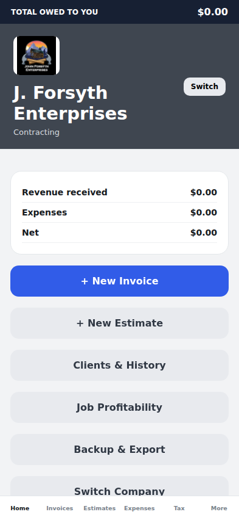

# V18 correction validation

Reference: forsyth-business-v18-production.html, provided through the user's file history.

Implemented in this correction:
- Granite header, supplied business logos, total owed bar and v18 home shortcuts.
- Separate invoice/estimate lists, client history, archived document lists.
- New client/job creation from invoice editor; selected phone-contact import.
- Multiple lines, editable units/rates, notes, document photos, inclusive/additional taxes.
- Payment plans and staged amount due; payment recording; optional configured late fees.
- Editable default rates, business profiles, default message and payment instructions.
- Native PDF preview/share, additional recipients printed in PDF, CSV and JSON exports.
- V18 JSON/cloud imports without overwriting existing native records; validated native restore.

Checks:
- node tests/data.test.mjs: migration, repeat imports, payment stages, tax inclusion, job profitability, restore validation, number sequence, CSV escaping, PDF recipients/private costs and overdue charges.
- npm run test:ui (after web export and installing Playwright Chromium): phone-width browser rendering and workflow: create client/job/invoice, save 50/50 plan, record payment, reload persistence. No JavaScript runtime errors.
- Expo iOS JavaScript export.
- Supabase app_state/native_app_state have RLS enabled and owner restrictions on SELECT/INSERT/UPDATE/DELETE.

Still requires a signed iPhone build and device checks for Contacts, photo picking, PDF preview/share, keyboard/safe areas and live account import/backup/restore. Automatic backup is one-way with manual restore, rather than conflict-resolving two-way sync. Voice assistant and live banking remain unfinished and are not represented as working.

The main installed TestFlight app is unchanged until a new signed build is uploaded. This branch is the v18 correction source.

Browser-rendered home preview (393 × 852; native device verification still required):

